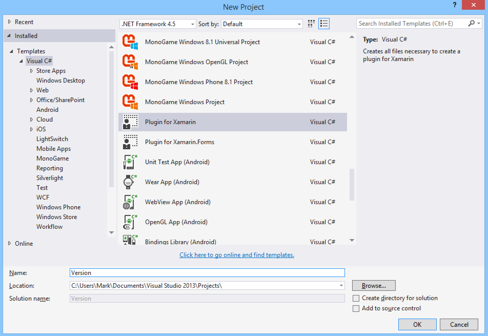
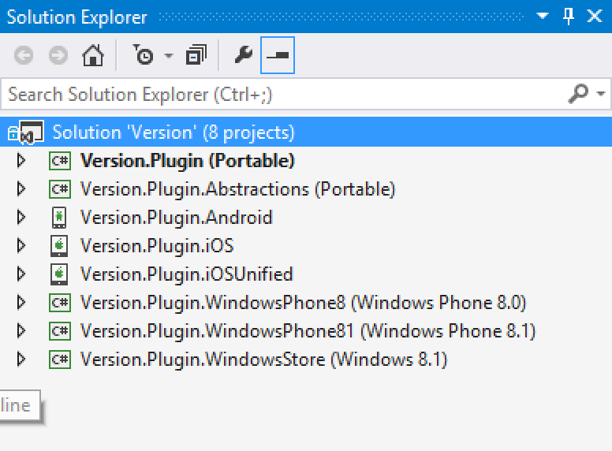
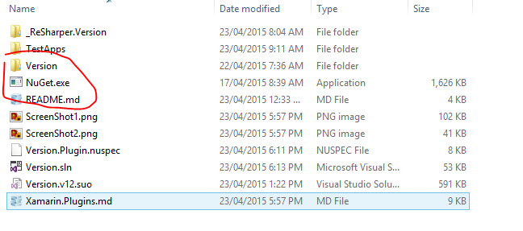
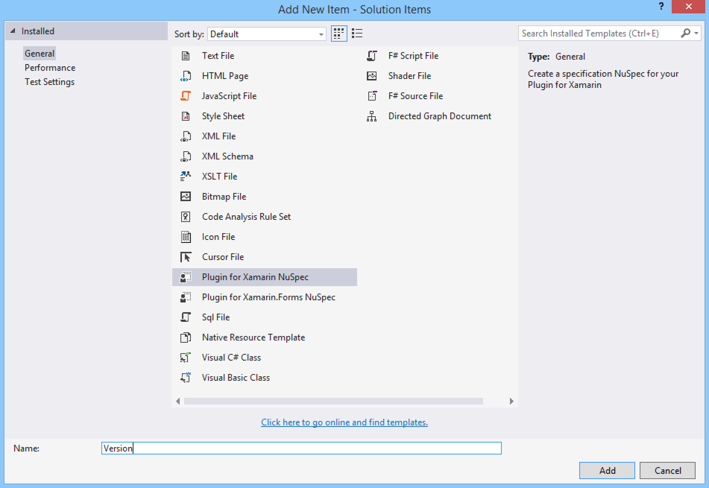
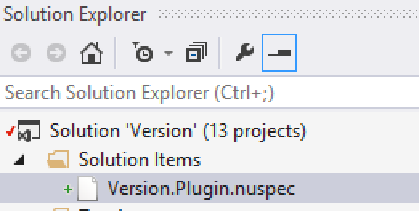
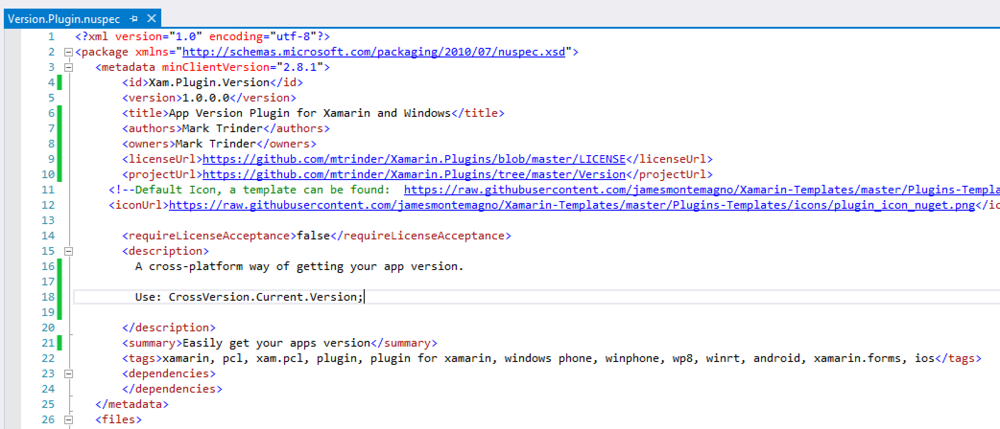
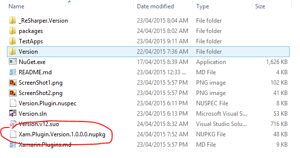
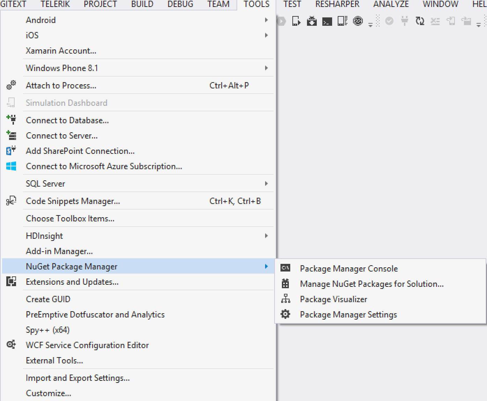
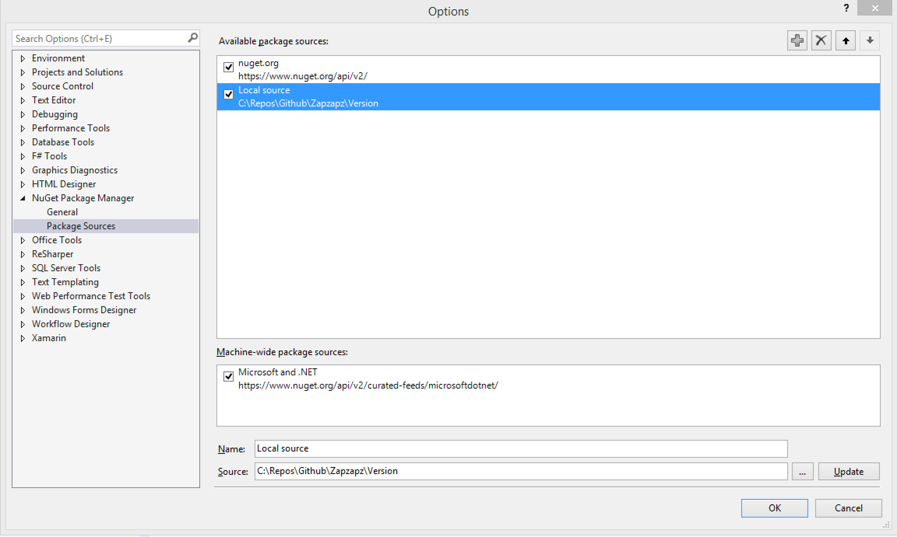
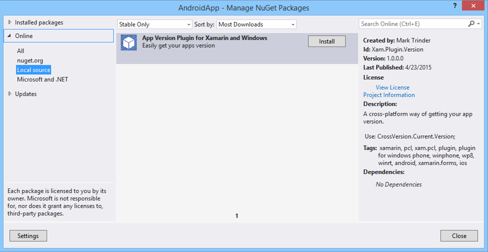

#Xamarin Plugins

Xamarin Plugins are a special kind of NuGet package that let you easily add cross-platform functionality to your apps. Using NuGet to distribute Plugins means that anyone can create them, and of course consume them. The platforms supported by Plugins include Android, iOS, iOS Unified (64bit), Windows Phone 8, Windows Phone 8.1 RT and Windows Store.

> Plugins abstract common device functionality or expose cross-platform APIs via a single interface

Plugins are small, have few or no dependencies, and provide a simple mechanism for accessing a single device feature. The following table represents some of the features you would expect to find on modern mobile devices.  

| OS Level ||||
|:------------- |:------------- |:------------- |:------------- |:------------- |
| Media | Speech To Text | App Settings | System Info
| **Hardware Level** ||||
| GPS | Network | Battery | Vibrate

The aim of a Plugin is to expose one such feature using an object singleton, accessed through an Interface that abstracts the platform specific implementation on all platforms. This approach in synonymous with using Inversion of Control ([IoC](http://en.wikipedia.org/wiki/Inversion_of_control)) and the [Service Locator]() pattern to invoke platform specific code from within a shared project or a Portable Class Library ([PCL](http://blogs.msdn.com/b/dotnet/archive/2013/10/14/portable-class-library-pcl-now-available-on-all-platforms.aspx)).

##Plugins Aren't Components

> But they can be by following the Component creation and publishing [guidelines](http://en.wikipedia.org/wiki/Service_locator_pattern).

A Xamarin Component gives developers the opportunity to disrtibute cross-platform libraries together in one neat package. When you install the Component within your Xamarin mobile project the correct implementation is installed.

Components typically differ from Plugins in two ways,  

* they are used to offer cross-platform functionality at the UI level
* and they deeply integrate into each platform they target

These differences usually result in diverging API implementations on each platform. As a consequence the use of the API becomes tightly coupled to each platform. In addition, very few Components target all of iOS, Android and Windows. Plugins, on the other hand, strive for a true cross-platform offering through one common API.

##Plugin Development & Deployment

Plugins can be created by anyone and are a third-party driven part of the Xamarin ecosystem. Plugins do not need to be reviewed or approved by Xamarin.  

In order to build a Plugin you will need Visual Studio and a business license of Xamarin (use a fully featured 30 day trial if you're new to Xamarin). Publishing will require a NuGet [user account](https://www.nuget.org/users/account/LogOn?returnUrl=%2Fusers%2Faccount%2F). If you want to create and support your Plugins but have no intention to build and distribute apps, then you can apply for a special free license of Xamarin.  

Finally, you must publish your Plugin under an Open Source (OSS) friendly license like [MIT](http://en.wikipedia.org/wiki/MIT_License)

##Walkthrough

Many Plugins have already been published so definitely checkout the packages repository at [nuget.org](https://www.nuget.org/packages?q=plugin+for+xamarin) just in case your Plugin idea has already been developed. Alternatively you can view the Plugins offered in the [Xamarin Component store]().

###Cross-platform "Version"

It's common in almost every app to show the current version. Each platform uses a different approach for storing and retrieving this information, so abstracting this simple feature with a Plugin makes sense.  

####Quick Setup

* Check your NuGet [Package Manager](https://visualstudiogallery.msdn.microsoft.com/27077b70-9dad-4c64-adcf-c7cf6bc9970c) is up to date. Ensure minimum version 2.8.3
* Download and Install the [Xamarin Plugin Template](https://visualstudiogallery.msdn.microsoft.com/afead421-3fbf-489a-a4e8-4a244ecdbb1e) for Visual Studio
* Create a project using the new Plugin template. The name of the solution needs to be simple because it will used throughout the Plugin code structure as a prefix and postfix for classes and file names.

With all projects created and initialized the screen shot below shows what your solution structure should resemble. Each platform being targeted has an corresponding project, with two additional portable (PCL) projects needed to complete the Plugin architecture.

The project called Version.Plugin.Abstractions is where we need to define the common API Interface. If you expand this project's file structure you will see that an empty Interface has already been created for you by the template. For this walkthtough our interface is called IVersion.  

At a minimum this Plugin needs to return the app's version as a string, so we'll add a getter property to our API.

    /// 

    /// Interface for Version
    /// 

    public interface IVersion
    {
        /// 

        /// Current App Version
        /// 

        string Version { get; }
    }

That's it. With our API defined we just need to create concrete implementations for each targeted platform.  
When the template created each platform specific project, it added an implementation class with the name of your Plugin as the prefix. 

**IVersion for iOS Implementation**

    ///
    /// ./Version.Plugin.iOS/VersionImplementation.cs
    ///
    public class VersionImplementation : IVersion
    {
      readonly NSString _buildKey;
      readonly NSString _versionKey;
    
      public VersionImplementation()
      {
          _buildKey = new NSString("CFBundleVersion");
          _versionKey = new NSString("CFBundleShortVersionString");
      }
    
      /// 

      /// Returns the app version with build number appended
      /// 

      public string Version
      {
          get
          {
              var build = NSBundle.MainBundle.InfoDictionary.ValueForKey(_buildKey);
              var version = NSBundle.MainBundle.InfoDictionary.ValueForKey(_versionKey);
              return string.Format("{0}.{1}", version, build);
          }
      }
    }

**IVersion for Android Implementation**

    ///
    /// ./Version.Plugin.Android/VersionImplementation.cs
    ///
    public class VersionImplementation : IVersion
    {
      /// 

      /// Returns the app version
      /// 

      public string Version
      {
          get { return GetPackageVersion(); }
      }
    
      static string GetPackageVersion()
      {
          try
          {
              return Application.Context.PackageManager.GetPackageInfo(
                  Application.Context.PackageName, PackageInfoFlags.MetaData).VersionName;
          }
          catch
          {
              return string.Empty;
          }
      }
    }

> The other platform implementations can be found in the [sample code](https://github.com/mtrinder/Xamarin.Plugins/tree/master/Version/Version) along with [apps](https://github.com/mtrinder/Xamarin.Plugins/tree/master/Version/TestApps) for testing each one.

####CrossVersion Class

Using the API is the same on each platform.

    var version = CrossVersion.Current.Version;
    
    Debug.WriteLine(version);

As you can see the name of the class that exposes the API has the Plugin name as a postfix. This is the standard naming convention for accessing all Xamarin Plugins. For example, a cross-platform Plugin for "battery status" would be accessed with a CrossBattery class.

The CrossVersion class is located in the PCL called Version.Plugin. You may have noticed this class file is also linked into all of the platform specific projects. This simple yet powerful class ensures the correct IVersion implementation is loaded at runtime because it's compiled into each assembly.

    public class CrossVersion
    {
        static readonly Lazy<IVersion> Implementation = new Lazy<IVersion>(() =>
            #if PORTABLE
                null,
            #else
                new VersionImplementation(),
            #endif
              System.Threading.LazyThreadSafetyMode.PublicationOnly);
    
        public static IVersion Current
        {
            get
            {
                var version = Implementation.Value;
                if (version == null)
                {
                    throw new NotImplementedException("Don't use CrossVersion from your PCL without first installing the NuGet package in your main project first.");
                }
                return version;
            }
        }
    }

##NuGet Deployment

**Packaging**

Download NuGet.exe and add it to your solution root folder. This executable will be used via the command prompt.

NuGet.exe needs a specifications file in order to package your assemblies correctly. Add a NuSpec file to the solution and fill in appropriate details. The Plugin template installed a new file type allowing you to add one with most of the details filled in.

Make sure you fill in these required fields,

* id
* version
* title
* owners
* authors
* license and project urls
* descriptions

From a command prompt switch to the Plugin root folder. Set your NuGet account key, which can be found on your NuGet account profile page.

    nuget setapikey xxxxxxxx-xxxx-xxxx-xxxx-xxxxxxxxxxxx

Ensure your project configuration is in release mode and rebuild the solution. Then from the command prompt run the NuGet package command.

    nuget pack Version.Plugin.nuspec

The output of this command is a NuPkg file with all of your Plugin assemblies packaged together.

**Testing**

Before releasing the package to the public you'll need to test it throughly. The best way is to create a test app project and install the Plugin with the NuGet package manager.

Via the package manager settings, add another source location for the package manager to search.

The source path will be the root folder of your Plugin.

Check the Plugin installs correctly and the implementation works as expected.

**Publishing**

Once you've fully tested the Plugin package, use the command prompt and your account key to publish.

    nuget push Xam.Plugin.Version.1.0.0.0.nupkg xxxxxxxx-xxxx-xxxx-xxxx-xxxxxxxxxxxx